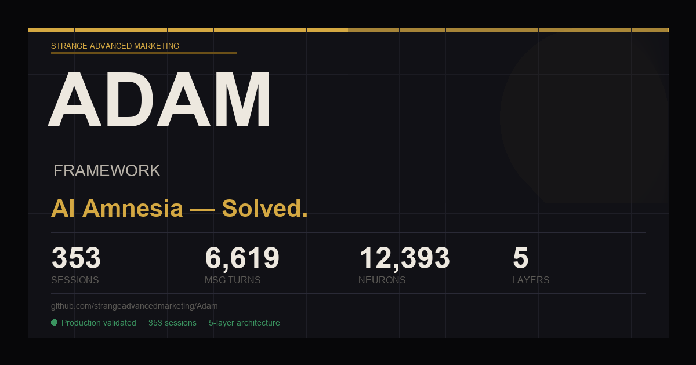

# The Adam Framework
### AI Amnesia — Solved. Within-Session Coherence Degradation — Solved.

> "Every time you start a new session, your AI forgets everything.  
> This framework fixes that."



**[→ Landing page](https://strangeadvancedmarketing.github.io/Adam/)** · **[→ Interactive proof](https://strangeadvancedmarketing.github.io/Adam/showcase/ai-amnesia-solved.html)** · **[→ The origin story](docs/LINEAGE.md)** · **[→ The full 8-month arc](docs/LINEAGE_EXTENDED.md)** · **[→ Community showcase](SHOWCASE.md)**

---

## What This Is

The Adam Framework is a **5-layer persistent memory and coherence architecture** for local AI assistants built on [OpenClaw](https://openclaw.ai). It was developed over 8 months, across 353 sessions and 6,619 message turns, by a non-coder running a live business on consumer hardware.

It solves two problems:

**AI Amnesia** — your assistant wakes up blank every session, forcing you to re-explain context, re-establish relationships, and re-orient toward goals that should already be understood.

**Within-Session Coherence Degradation** — as a session accumulates context, the model's reasoning consistency, identity coherence, and decision quality quietly degrade before compaction triggers. The model doesn't announce this. It just starts drifting.

**Starting line:** You already have OpenClaw running with a model talking to you. This framework gives your AI a persistent soul, memory, and identity. It doesn't replace what you have — it upgrades it.

---

## What Changes

**Day 1**
Your AI knows your name, your projects, and its own role before you say a single word. Sessions start with context. You stop re-explaining yourself.

**Week 1**
The neural graph has real connections. Your AI starts referencing things from previous sessions without being prompted — not because you told it to, but because the associative architecture is building a real map of your work.

**Month 1**
The sleep cycle has merged weeks of daily logs into your core memory file. Your AI has accumulated genuine project state, real decisions, real history. The memory compounds. This is the solve for AI amnesia — not magic, just consistent architecture.

**The proof:** [353 sessions, 6,619 turns, 30 days of production use.](docs/PROOF.md) The system on your desk is the evidence.

---

## The 5-Layer Architecture

```
┌──────────────────────────────────────────────────────┐
│  LAYER 1: VAULT INJECTION                            │
│  Identity files loaded at every boot. Your AI wakes  │
│  up knowing who it is and who you are.               │
├──────────────────────────────────────────────────────┤
│  LAYER 2: MID-SESSION MEMORY SEARCH                  │
│  memory-core plugin — live retrieval during session. │
│  The AI can reach into its own memory mid-chat.      │
├──────────────────────────────────────────────────────┤
│  LAYER 3: NEURAL GRAPH                               │
│  Associative recall, not keyword search.             │
│  Concepts link to concepts. Context propagates.      │
├──────────────────────────────────────────────────────┤
│  LAYER 4: NIGHTLY RECONCILIATION                     │
│  Gemini merges daily logs into CORE_MEMORY.md.       │
│  Memory grows while you sleep. Nothing is lost.      │
├──────────────────────────────────────────────────────┤
│  LAYER 5: COHERENCE MONITOR                          │
│  SENTINEL checks scratchpad dropout + token depth    │
│  every 5 min. Drifting? Re-anchor fires into         │
│  BOOT_CONTEXT.md before damage is done.              │
└──────────────────────────────────────────────────────┘
```

All five layers run simultaneously. The memory is in the files. The model is just the reader — swap the LLM, keep the Vault, your AI's continuity persists.

---

## What's In This Repo

```
adam-framework/
├── README.md
├── CONTRIBUTING.md            ← How to contribute (Linux port, new providers, etc.)
├── SHOWCASE.md                ← Community deployments — add yours
├── SETUP_HUMAN.md             ← Human guide: you have OpenClaw, now give it a soul
├── SETUP_AI.md                ← Agent guide: have your existing AI set this up for you
├── engine/
│   ├── openclaw.template.json     ← Gateway config (sanitized, all placeholders)
│   ├── SENTINEL.template.ps1      ← Watchdog / auto-start / sleep cycle
│   └── mcporter.template.json     ← MCP server wiring
├── vault-templates/
│   ├── SOUL.template.md           ← AI identity schema
│   ├── CORE_MEMORY.template.md    ← Project/state tracking schema
│   ├── BOOT_SEQUENCE.md           ← Boot order explanation
│   ├── coherence_baseline.template.json  ← Layer 5 baseline tracking schema
│   ├── coherence_log.template.json       ← Layer 5 event log schema
│   └── active-context.template.md ← Active task tracking
├── tools/
│   ├── legacy_importer.py         ← Step 1: Extract facts from Claude/ChatGPT export
│   ├── ingest_triples.ps1         ← Step 2: Feed extracted facts into neural graph
│   ├── reconcile_memory.py        ← Nightly sleep cycle (runs via SENTINEL)
│   ├── coherence_monitor.py       ← Layer 5: scratchpad dropout detector + re-anchor
│   └── test_coherence_monitor.py  ← 33-test suite, validated against live session data
├── docs/
│   ├── ARCHITECTURE.md            ← Deep dive on all 5 layers
│   ├── CONFIG_REFERENCE.md        ← Every config field explained
│   ├── PROOF.md                   ← The 353-session proof of work
│   ├── SETUP.md                   ← Detailed setup guide (30-min walkthrough)
│   ├── CONTEXT_COMPILER.md        ← How BOOT_CONTEXT.md works (hippocampus/cortex split)
│   ├── SWARM.md                   ← Multi-agent coordination via shared Vault
│   ├── SKILLS_SYSTEM.md           ← Pluggable capability layer (documentation-first plugins)
│   ├── LESSONS_LEARNED.md         ← Production failure log: symptoms, root causes, fixes
│   ├── LINEAGE.md                 ← How this was built: the uncut origin story
│   └── LINEAGE_EXTENDED.md        ← The full 8-month arc: all three AIs, cross-referenced
└── showcase/
    └── ai-amnesia-solved.html     ← Interactive data visualization
```

---

## What It Looks Like

This is what a successful SENTINEL boot looks like — the AI coming online with full context loaded before you say a word:

```
[2026-03-03 08:00:01] Sentinel rising. Clearing stale processes...
[2026-03-03 08:00:02] Sleep cycle: running reconcile_memory.py (offline — Markdown + neural only)...
[2026-03-03 08:00:03] Sleep cycle complete.
[2026-03-03 08:00:03] Date injected: 2026-03-03
[2026-03-03 08:00:03] Compiling BOOT_CONTEXT.md...
[2026-03-03 08:00:04] BOOT_CONTEXT.md compiled (4 sources merged)
[2026-03-03 08:00:05] Gateway started — PID 9421
[2026-03-03 08:00:05] Vector reindex triggered successfully.
[2026-03-03 08:00:05] SENTINEL ACTIVE — Watchdog loop running.

> Hey, good morning.

Adam: Morning. TurfTracker has three contractor leads in the queue from last night —
Doctor Paver Corp looks strongest, no website, active on Reddit. Sleep cycle ran at
02:14, merged 6 session logs into CORE_MEMORY. Neural graph at 12,393 neurons.
What are we working on first?
```

No "How can I help you today?" No re-explaining your projects. It already knows.

For the full visual proof — 353 sessions of data rendered as charts: **[Interactive showcase →](https://strangeadvancedmarketing.github.io/Adam/showcase/ai-amnesia-solved.html)**

---

## Two Ways to Set This Up

### Path 1 — You do it (30–60 min)

Read **[SETUP_HUMAN.md](SETUP_HUMAN.md)**. It's written for humans, starting from "you have OpenClaw running." Four phases: identity, neural memory, Session 000 history seeding, sleep cycle. Fully step-by-step.

### Path 2 — Your AI does it for you

If you're already talking to an AI assistant, give it **[SETUP_AI.md](SETUP_AI.md)**. It's written for AI agents — terse, sequential, command-first, with explicit success conditions at each step. Your AI reads it, asks you 8 questions, and installs everything. No model assumptions — works with any LLM.

---

## Session 000 — Seed Your History

The most powerful optional step: export your conversation history from Claude and/or ChatGPT and feed it into your neural graph before your first real session.

```powershell
# Step 1: Extract facts from your export
python tools\legacy_importer.py --source export.zip --vault-path C:\MyVault --user-name YourName

# Review extracted_triples.json — edit if you want — then:

# Step 2: Ingest into neural graph (~56 min for 740 facts, runs in background)
.\tools\ingest_triples.ps1 -VaultPath C:\MyVault
```

Your AI wakes up already knowing your history. Every decision, tool, project, and relationship you've discussed with any AI — loaded as a foundation.

---

## Prerequisites

- Windows 10/11, macOS, or Linux
  - Windows: `SENTINEL.template.ps1` (PowerShell)
  - macOS/Linux: `SENTINEL.template.sh` (bash) + `com.adamframework.sentinel.plist` (launchd, macOS)
- [OpenClaw](https://openclaw.ai) already installed and running
- [Python 3.10+](https://python.org)
- [mcporter](https://www.npmjs.com/package/mcporter): `npm install -g mcporter`
- An LLM API key — [NVIDIA Developer free tier](https://build.nvidia.com) is recommended (Kimi K2.5, 131K context, free)
- A [Gemini API key](https://aistudio.google.com/app/apikey) — free — for the nightly sleep cycle

---

## The Proof

Validated in production, not a lab:

| Metric | Value |
|--------|-------|
| Total sessions | 353 |
| Message turns | 6,619 |
| Neural graph neurons | 12,393 |
| Neural graph synapses | 40,532 |
| Model migrations survived | 4 |
| System rebuilds survived | 2 (including one full nuclear reset, February 14–16, 2026) |
| Identity preserved through all of it | ✓ |
| Time from zero terminal knowledge to production app | 18 days |
| Time to solve AI amnesia (from first Layer 1 implementation) | 30 days |
| Time to solve within-session coherence degradation | 35 days |
| Layer 5 coherence monitor test coverage | 33/33 passing against live data |

> **Neural graph numbers are live — updated every night by the sleep cycle.**
> Each reconcile run snapshots current neuron/synapse counts to `workspace/neural_metrics.json`.
> This isn't a frozen demo. The graph grows while the system runs.

Full story: [docs/PROOF.md](docs/PROOF.md) · How it was built: [docs/LINEAGE.md](docs/LINEAGE.md) · Interactive visualization: [showcase/ai-amnesia-solved.html](showcase/ai-amnesia-solved.html)

---

## The Key Insight

> **The memory is in the files. The model is just the reader.**

When the system was completely wiped and rebuilt, the AI came back online with full continuity because the identity files survived. Same base model. Same Vault files. Same AI.

This means the framework is model-agnostic. Swap the LLM, keep the Vault — your AI's memory persists.

---

## Debugging & Known Issues

Something broken? Start with **[docs/LESSONS_LEARNED.md](docs/LESSONS_LEARNED.md)**.

Every failure mode encountered in production is documented there with: exact symptom, root cause, log commands to confirm it, and the fix that worked. The most important rule:

> **The gateway fails silently on bad config — it doesn't crash, it just stops reloading.**
> If behavior is degraded but the process is alive, check the config first.

---

## Roadmap

See **[ROADMAP.md](ROADMAP.md)** for what's shipped, what's in progress, and the open community opportunities (Linux/macOS port, additional model providers, Obsidian plugin).

---

## License

MIT. Use it, build on it, ship it.

---

## Built By

Jereme Strange — Strange Advanced Marketing  
Miami, FL

*No CS degree. No research team. No GPU cluster. Just a problem that needed solving.*
